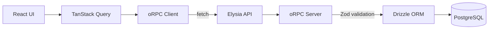
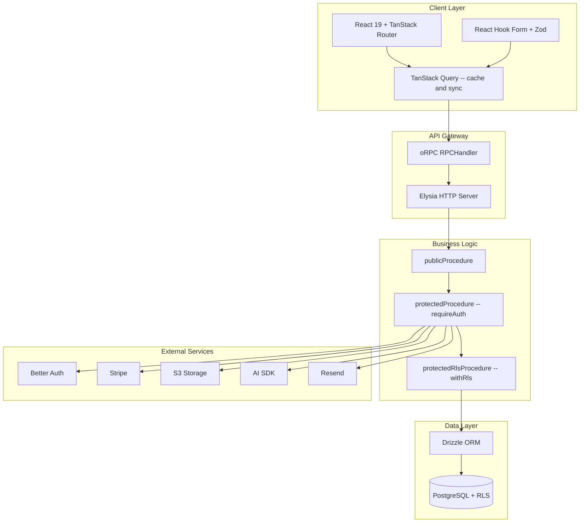

<!-- TODO: Add banner image -->

<h1 align="center">Start Kit</h1>

<p align="center">
  <strong>The production-ready SaaS starter kit for the modern TypeScript stack.</strong>
</p>

<p align="center">
  <a href="https://www.npmjs.com/package/create-start-kit-dev"></a>
  <a href="https://github.com/CarlosZiegler/start-kit.dev/blob/main/LICENSE"></a>
  <a href="https://github.com/CarlosZiegler/start-kit.dev"></a>
  
  
</p>

<p align="center">
  TanStack Start &middot; React 19 &middot; oRPC &middot; Drizzle &middot; Better Auth &middot; Stripe &middot; AI SDK
</p>

Ship your SaaS faster with a fully typed stack from UI to database. Start Kit gives you authentication, organizations, payments, AI chat, file storage, and 57 accessible UI components — all wired together with end-to-end type safety through oRPC and TanStack Query.

```bash
bunx create-start-kit-dev create my-app
```

---

## Table of Contents

- [Why Start Kit?](#why-start-kit)
- [Features](#features)
- [Architecture](#architecture)
- [Getting Started with the CLI](#getting-started-with-the-cli)
- [Project Structure](#project-structure)
- [The Stack](#the-stack)
- [AI-Enhanced Development](#ai-enhanced-development)
- [Manual Setup](#manual-setup)
- [Deployment](#deployment)
- [Contributing](#contributing)
- [License](#license)

---

## Why Start Kit?

### End-to-End Type Safety

The entire data path is typed: React components call oRPC client functions, which hit oRPC server procedures validated by Zod schemas, which query PostgreSQL through Drizzle ORM's TypeScript-native schema definitions. Change a column name in your Drizzle schema and TypeScript catches every broken callsite at compile time. No `any` types, no runtime surprises, no code generation step.

### TanStack Start, Not Next.js

TanStack Start is a full-stack React framework built on Vite and React Router. You get SSR, streaming, and file-based routing without vendor lock-in. Deploy to Vercel, Docker, Cloudflare, or bare metal — the server adapter is a config switch, not a rewrite. React Router under the hood means you are using battle-tested routing, not a framework-specific abstraction that changes every major version.

### oRPC + TanStack Query

oRPC is a type-safe RPC layer that is lighter than tRPC and ships with OpenAPI spec support out of the box. Combined with TanStack Query, you get automatic caching, background refetching, cache invalidation, optimistic updates, and pagination — all with full type inference from your Zod schemas to your React components. Zero code generation required.



### Auth That Actually Works

Better Auth ships with a plugin architecture that covers real-world auth requirements: organization management with RBAC (owner/admin/member roles), passkeys via WebAuthn, two-factor authentication with TOTP, email OTP, magic links, session management, an admin panel, and Stripe customer sync. Each feature is a composable plugin you opt into — not a monolithic auth library that forces everything on you.

Sessions are prefetched in the root layout's `beforeLoad` hook and made available throughout the app via TanStack Query. Protected routes check the session before rendering and redirect unauthenticated users to `/sign-in`. Role-based guards in `src/components/guards/` let you conditionally render UI based on the user's role within an organization.

---

## Features

| Category | What You Get |
|----------|-------------|
| **Auth** | Organizations, RBAC (owner/admin/member), Passkeys, 2FA (TOTP), Email OTP, Sessions |
| **Database** | PostgreSQL + Drizzle ORM + Row-Level Security (automatic tenant isolation) |
| **API** | oRPC type-safe RPC + Zod validation + TanStack Query integration |
| **AI** | Streaming chat UI, multi-provider (OpenAI, Anthropic, Google), voice input |
| **Payments** | Stripe subscriptions — Free, Starter ($9/mo), Pro ($29/mo), Enterprise ($99/mo) |
| **UI** | 57 accessible shadcn components, Tailwind CSS v4, CVA variants, dark mode |
| **Storage** | S3-compatible (AWS, Cloudflare R2, SeaweedFS, DigitalOcean Spaces) |
| **Email** | React Email templates + Resend (verification, OTP, password reset, notifications) |
| **Forms** | React Hook Form + Zod + accessible Field/FieldError components |
| **i18n** | i18next with browser language detection, lazy-loaded bundles |
| **Charts** | Recharts data visualization |
| **DnD** | Drag-and-drop with @dnd-kit |
| **Flow** | Interactive node-based diagrams with XY Flow |
| **Testing** | Vitest + React Testing Library |
| **Code Quality** | Ultracite (Biome) + TypeScript strict mode |

---

## Architecture

### System Overview



### Data Flow

The full request lifecycle flows through typed boundaries at every step:

```
UI (React) --> React Query --> oRPC Client --> /api/rpc (Elysia) --> oRPC Server --> Drizzle ORM --> PostgreSQL
```

React components call `useQuery()` or `useMutation()` with oRPC-generated options. TanStack Query manages caching, deduplication, and background refetching. The oRPC client serializes the call to a fetch request against the Elysia API gateway. On the server, the oRPC handler validates input with Zod, runs through the middleware chain, executes the Drizzle query, and returns a typed response.

### Middleware Chain

Every oRPC procedure passes through a layered middleware chain. Each layer adds context and enforcement:

| Procedure | What It Does |
|-----------|-------------|
| `publicProcedure` | No auth required. Used for landing pages, health checks, and public API endpoints. |
| `protectedProcedure` | Requires an authenticated session. Injects `user` and `session` into the procedure context via `requireAuth` middleware. |
| `protectedRlsProcedure` | Authenticated + PostgreSQL Row-Level Security. The `withRls` middleware sets `request.user_id` and `request.org_id` on the database transaction, so every query is automatically scoped to the current user and organization. |

### Query Pattern

```tsx
// Type-safe query with automatic caching
const { data } = useQuery(orpc.profile.get.queryOptions({ input: { id } }))

// Conditional queries with skipToken
const { data: results } = useQuery(
  orpc.agents.list.queryOptions({
    input: search ? { search } : skipToken,
  })
)

// Smooth transitions during pagination or search
const { data, isLoading } = useQuery({
  ...orpc.agents.list.queryOptions({ input }),
  placeholderData: keepPreviousData,
})
```

### Mutation Pattern

```tsx
const mutation = useMutation(orpc.profile.update.mutationOptions({
  onSuccess: () => {
    queryClient.invalidateQueries({ queryKey: orpc.profile.get.queryKey() })
    toast.success("Saved")
  },
  onError: (e: Error) => toast.error(e.message),
}))
```

### Form Pattern

```tsx
const formSchema = z.object({
  email: z.string().email(),
  password: z.string().min(8),
})

const form = useForm<z.infer<typeof formSchema>>({
  resolver: zodResolver(formSchema),
  mode: "onChange",
})

<Controller
  name="email"
  control={form.control}
  render={({ field, fieldState }) => (
    <Field data-invalid={fieldState.invalid}>
      <FieldLabel htmlFor={field.name}>Email</FieldLabel>
      <Input {...field} id={field.name} aria-invalid={fieldState.invalid} />
      {fieldState.invalid && <FieldError errors={[fieldState.error]} />}
    </Field>
  )}
/>
```

### Cache Invalidation

After mutations, invalidate related queries to keep the UI in sync:

```tsx
// Invalidate a specific query
queryClient.invalidateQueries({ queryKey: orpc.profile.get.queryKey() })

// After auth mutations, refetch the session
refetchSession()
```

---

## Getting Started with the CLI

### Create a New Project

```bash
bunx create-start-kit-dev create my-app
```

The CLI scaffolds the template and walks you through five resumable configuration phases:

| Phase | What It Does |
|-------|-------------|
| **Branding** | App name, description, domain |
| **Features** | Toggle: Stripe, AI Chat, Storage, Redis, Email |
| **Database** | PostgreSQL connection (auto-create via Neon or custom URL) |
| **Environment** | Generate `.env` with all required API keys |
| **Infrastructure** | Docker services (SeaweedFS for storage, Redis for caching) |

### Theme Customization

Pass theme flags during project creation to customize the look and feel:

```bash
bunx create-start-kit-dev create my-app --theme purple --radius lg --font geist
```

**21 theme colors:** neutral, stone, zinc, gray, amber, blue, cyan, emerald, fuchsia, green, indigo, lime, orange, pink, purple, red, rose, sky, teal, violet, yellow

**4 base colors:** neutral, stone, zinc, gray

**5 radius presets:** none, sm, md, lg, xl

**3 fonts:** inter, geist, system

### Resume or Jump to a Phase

The setup wizard saves progress. You can resume where you left off or jump to a specific phase:

```bash
bunx create-start-kit-dev init                    # Resume from where you left off
bunx create-start-kit-dev init --step database    # Jump to a specific phase
```

---

## Project Structure

### Monorepo

The project uses Turborepo with Bun workspaces for monorepo management. Each workspace has its own dependencies and build configuration:

```
start-kit.dev/
├── apps/
│   └── start-template/     # The SaaS application
├── packages/
│   └── cli/                # create-start-kit-dev interactive CLI
├── skills/                 # Claude Code AI development skills
├── docs/                   # Planning and design documents
├── turbo.json              # Turborepo build orchestration
└── package.json            # Root workspace config
```

### Application Source (`apps/start-template/src/`)

```
src/
├── routes/                 # File-based routing (TanStack Router)
│   ├── __root.tsx          # Root layout -- providers, auth prefetch, i18n
│   ├── (auth)/             # Auth pages -- sign-in, sign-up, forgot-password
│   ├── (dashboard)/        # Protected pages -- org, settings, profile, chat
│   └── api/                # API endpoints -- RPC, auth, chat, storage
├── features/               # Feature modules (co-located UI + logic)
│   ├── organizations/      # Org CRUD, invitations, member management
│   ├── settings/           # Profile, security, appearance sections
│   ├── subscription/       # Stripe subscription management
│   ├── payment/            # Checkout flow
│   ├── landing/            # Landing page components
│   └── command-search/     # Command palette (Cmd+K)
├── components/
│   ├── ui/                 # ~57 shadcn primitives (Button, Card, DataGrid...)
│   ├── ai-elements/        # AI chat (Message, CodeBlock, Canvas...)
│   ├── emails/             # React Email templates
│   └── guards/             # Permission-based conditional rendering
├── lib/
│   ├── auth/               # Better Auth config, client, RBAC permissions
│   ├── db/                 # Drizzle schema, RLS policies, migrations
│   ├── storage/            # S3 client, presigned URLs
│   ├── stripe/             # Stripe config, plan definitions
│   ├── intl/               # i18n setup, language detection
│   └── validations/        # Shared Zod schemas
├── orpc/                   # Type-safe RPC layer
│   ├── orpc-server.ts      # Middleware chain, context, procedures
│   ├── orpc-client.ts      # Client + TanStack Query utils
│   └── routes/             # Procedure definitions per domain
├── hooks/                  # Custom React hooks
├── utils/                  # Utility functions
├── app.css                 # Tailwind design tokens (OKLCH)
├── router.tsx              # TanStack Router config
├── client.tsx              # Client entry
└── server.ts               # Server entry
```

---

## The Stack

### Bun

Runtime and package manager. Faster than Node for installs, builds, and server start. Ships with a native S3 client and SQL driver, removing the need for extra dependencies. All scripts in this project run through Bun.

### TanStack Start

Full-stack React framework built on Vite and React Router. Provides SSR, streaming, and file-based routing with no vendor lock-in. Uses Nitro for server adapters, so you can deploy to Vercel, Cloudflare, Node, Bun, or Docker with a config change.

```tsx
// File-based route with auth check
export const Route = createFileRoute("/(dashboard)/settings")({
  beforeLoad: async ({ context }) => {
    if (!context.session) throw redirect({ to: "/sign-in" })
  },
  component: SettingsPage,
})
```

### oRPC

Type-safe RPC layer that is lighter than tRPC and generates OpenAPI specs automatically. Define procedures with Zod schemas, call them from React with full type inference. No code generation step, no build plugin. The `orpc.*.queryOptions()` pattern wires directly into TanStack Query.

```tsx
// Define a type-safe procedure with Zod validation
const profileUpdate = protectedProcedure
  .input(z.object({ name: z.string().min(1), email: z.string().email() }))
  .handler(async ({ input, context }) => {
    return await context.db.update(users).set(input).where(eq(users.id, context.session.user.id))
  })
```

### TanStack Query

Server state management that bridges oRPC and your UI. Automatic caching, background refetching, cache invalidation, optimistic updates, and pagination. Combined with oRPC's `queryOptions()` and `mutationOptions()`, you get type-safe data fetching with zero boilerplate.

```tsx
// oRPC + TanStack Query = type-safe data fetching in one line
const { data } = useQuery(orpc.profile.get.queryOptions({ input: { id } }))
```

### Drizzle ORM

Type-safe PostgreSQL access where the schema is TypeScript code. Zero-dependency migrations, built-in Drizzle Studio for visual database browsing, and support for Bun's native SQL driver. Schema changes propagate type errors to every query and mutation that touches the affected columns.

```tsx
// Schema-as-code — change a column, TypeScript catches every callsite
export const users = pgTable("users", {
  id: text("id").primaryKey(),
  name: text("name").notNull(),
  email: text("email").notNull().unique(),
})
```

### PostgreSQL + Row-Level Security

Every query is automatically scoped to the current user and organization through RLS policies. The `protectedRlsProcedure` middleware sets `request.user_id` and `request.org_id` on each database transaction, so tenant isolation is enforced at the database level — not in application code.

### Better Auth

TypeScript-first authentication with a composable plugin architecture. Ships with: organization management, passkeys (WebAuthn), 2FA (TOTP), email OTP, magic links, admin panel, and Stripe customer sync. Each feature is an independent plugin you opt into.

```tsx
// Composable auth — add only the plugins you need
export const auth = betterAuth({
  plugins: [organization(), twoFactor(), passkey(), stripe(), admin()],
})
```

### Elysia

Bun-native HTTP framework that powers the API gateway. Connects oRPC to HTTP at `/api/rpc` with type-safe request and response handling. Lightweight and fast on the Bun runtime.

### Tailwind CSS v4 + shadcn/ui

CSS-first configuration with no `tailwind.config` file. All design tokens are defined in `app.css` using the OKLCH color space. 57 accessible components built on Base UI with `data-slot` attributes for targeted styling. Dark mode is class-based and automatic.

### React 19

Latest React with `ref` as a prop (no `forwardRef`), function components only. Paired with React Hook Form and Zod for type-safe, accessible form handling with field-level validation.

---

## AI-Enhanced Development

Start Kit ships with **Claude Code skills** — structured rules that teach Claude your project's architecture, patterns, and conventions. When you use Claude Code in this project, it understands your stack and writes code that fits.

### Project Skills

| Skill | What It Teaches Claude |
|-------|----------------------|
| `start-kit-dev-best-practices` | Full architecture — oRPC procedures, middleware chain, feature modules, file organization, DB schemas, RLS policies, auth, RBAC, UI patterns, forms, data grid, Stripe, S3, testing, i18n |
| `tanstack-start-best-practices` | Server functions, SSR/streaming, middleware, route protection, API routes, deployment adapters |
| `tanstack-router-best-practices` | File-based routing, search params, data loading, preloading, virtual routes, type-safe navigation |
| `tanstack-query-best-practices` | Query keys, caching, stale/gc time, mutations, invalidation, optimistic updates, pagination, SSR dehydration |
| `tanstack-integration-best-practices` | Full-stack data flow, loader-query patterns, hydration, cache as single source of truth |
| `Better Auth Best Practices` | Auth integration, session management, organization setup, plugin configuration |
| `stripe-best-practices` | Payment flows, webhook handling, subscription management |

### Shared Skills

| Skill | Scope |
|-------|-------|
| `web-design-guidelines` | Design principles, layout, typography, accessibility |
| `vercel-react-best-practices` | React patterns, performance, component composition |
| `vercel-composition-patterns` | Advanced component patterns, server/client boundaries |

### How to Use

Open the project with Claude Code. Skills are auto-detected from the `.claude/skills/` and `skills/` directories. No configuration needed — Claude reads the skill definitions and applies them when generating code for your project.

---

## Manual Setup

### 1. Clone and Install

```bash
git clone https://github.com/CarlosZiegler/start-kit.dev.git
cd start-kit.dev
bun install
```

### 2. Environment Variables

```bash
cp apps/start-template/.env.example apps/start-template/.env
```

**Required:**

| Variable | Description |
|----------|-------------|
| `DATABASE_URL` | PostgreSQL connection string |
| `BETTER_AUTH_SECRET` | Auth secret — generate with `openssl rand -base64 32` |
| `BETTER_AUTH_BASE_URL` | App URL (e.g., `http://localhost:3000`) |
| `RESEND_API_KEY` | Email delivery ([resend.com](https://resend.com)) |

**Optional:**

| Variable | Description |
|----------|-------------|
| `OPENAI_API_KEY` | AI chat (OpenAI) |
| `ANTHROPIC_API_KEY` | AI chat (Anthropic) |
| `GOOGLE_GENERATIVE_AI_API_KEY` | AI chat (Google) |
| `STRIPE_SECRET_KEY` | Payments |
| `STRIPE_PUBLISHABLE_KEY` | Payments (client-side) |
| `STRIPE_WEBHOOK_SECRET` | Stripe webhooks |
| `S3_ACCESS_KEY_ID` | File storage |
| `S3_SECRET_ACCESS_KEY` | File storage |
| `S3_BUCKET` | Storage bucket name |
| `REDIS_URL` | Redis caching |
| `DISABLE_SIGN_UP` | Set to `true` to block new account registration |

### 3. Database and Dev Server

```bash
cd apps/start-template
bun run db:push    # Push schema to PostgreSQL
bun run dev        # Start dev server on port 3000
```

### 4. Scripts Reference

| Command | Description |
|---------|-------------|
| `bun run dev` | Start dev server (port 3000) |
| `bun run build` | Production build |
| `bun run start` | Start production server |
| `bun run test` | Run tests |
| `bun run test:watch` | Tests in watch mode |
| `bun run test:coverage` | Tests with coverage |
| `bun run db:push` | Push schema to database |
| `bun run db:generate` | Generate migrations |
| `bun run db:studio` | Open Drizzle Studio |
| `bun run email:dev` | Preview emails (port 5555) |
| `bun run check` | Lint and format check |
| `bun run fix` | Auto-fix lint and format |

---

## Deployment

### Vercel

```bash
# Install dependencies
bun install --frozen-lockfile

# Build
bun run build
```

Set your environment variables in the Vercel dashboard: `DATABASE_URL`, `BETTER_AUTH_SECRET`, `BETTER_AUTH_BASE_URL`, `RESEND_API_KEY`, and any optional keys for Stripe, AI, or storage.

### Docker

Build and run the application as a Docker container:

```bash
# Build the image
bun run docker:build

# Run with environment variables
docker run -p 3000:3000 --env-file .env tanstack-start-app
```

The Dockerfile uses a multi-stage build optimized for the Bun runtime. The production image includes only the compiled output and runtime dependencies.

### Infrastructure Services

Start Kit includes Docker Compose configurations for local development services:

```bash
# Start SeaweedFS for S3-compatible local storage
bun run docker:storage

# Start Redis for caching
bun run redis:start

# Check Redis status
bun run redis:status
```

---

## Contributing

Contributions are welcome. To get started:

1. Fork the repository
2. Create a feature branch from `main`
3. Make your changes and run `bun run check` to verify lint and formatting
4. Open a pull request

For bugs, feature requests, or questions, open an issue:

[github.com/CarlosZiegler/start-kit.dev/issues](https://github.com/CarlosZiegler/start-kit.dev/issues)

---

## License

MIT — [Carlos Ziegler](https://github.com/CarlosZiegler)
